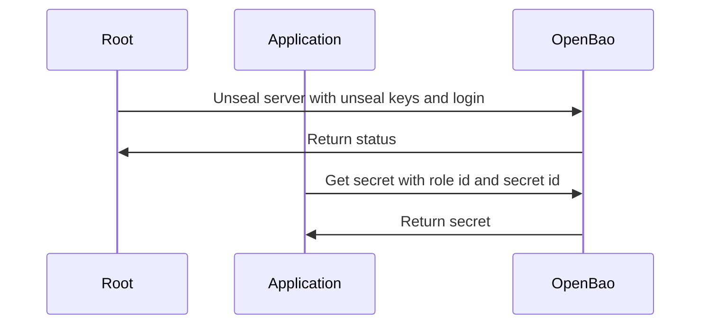
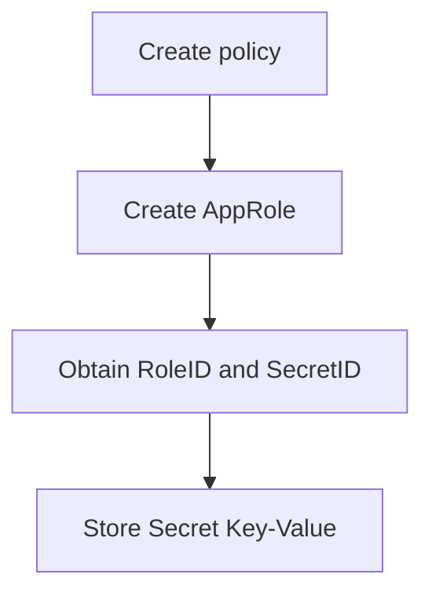
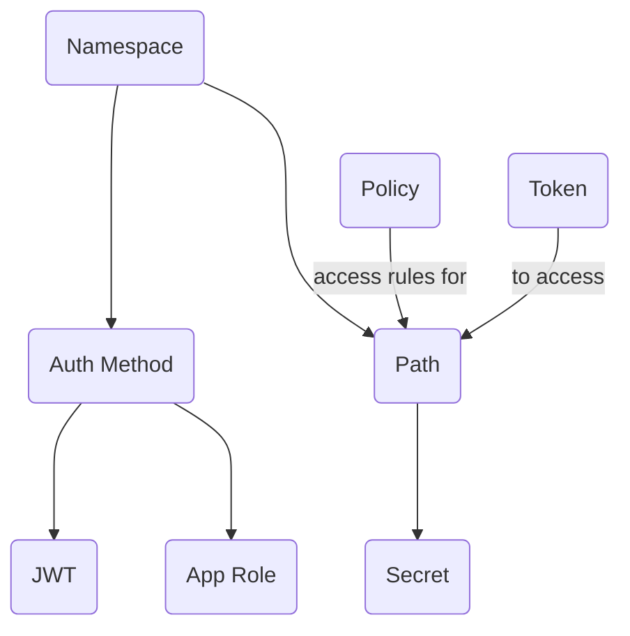

# OpenBao

OpenBao runs within `Docker` that is used for application development.

## Assumption

* You are running within the `docker` network `nginx-proxy`.

## Setup

Build the OpenBao container, and start an instance.

    docker-compose up -d

You can then access the WebUI through the following URL:

    http://127.0.0.1:8200

**NOTE** The `root` unseal keys and root token will be generate on first login.

## Using the Admin API

Refer to [sample.sh](sample.sh) on how to create namespace, policy, approle and secret

Refer to [route.http](route.http) on how to interact wit the Admin API.

## Sequence

### Unseal and login

The server has to be unsealed before you can interact with the server.



### Configure and use AppRole

This outlines the steps to configure and use AppRole authentication method.



## Unseal server using `curl`

Check server's seal status

    curl http://127.0.0.1:8200/v1/sys/seal-status

The JSON response will show `sealed: true`, the `t` number of unseal keys, and the current `progress`.

Depending on the number of unseal keys you have, you need to run the below `curl` with all your unseal keys.

    curl \
        --request PUT \
        --data '{"key": "<your_unseal_key>"}' \
        http://127.0.0.1:8200/v1/sys/unseal

## Unseal server using `sh`

From the host, access the shell in OpenBao using

    docker exec -it openbao-server sh

You should see this prompt

    / #

Check server's seal status

    bao status

Set the correct environment

    export BAO_ADDR="http://127.0.0.1:8200"

**NOTE** You need `export BAO_ADDR=http://127.0.0.1:8200` to avoid `http: server gave HTTP response to HTTPS client`.

Unseal server based on the number of unseal keys you have.

    bao operator unseal <unseal_key_1>
    bao operator unseal <unseal_key_2>
    bao operator unseal <unseal_key_3>
    bao login <root-token>

Seal the server

    bao operator seal

## Unseal server using `unseal.sh`

The script uses values stored in `.env`

```bash
./unseal.sh
```

## Create policy

Create policy

    echo 'path "secret/data/my-application/*" { capabilities = ["read"] }' | bao policy write my-app-policy -

Read policy

    bao policy read my-app-policy

## Create AppRole

Enable AppRole (if not enabled)

    bao auth enable approle

Create AppRole

    bao write auth/approle/role/my-app-role \
        token_policies="my-app-policy"

Or, with `ttl`

    bao write auth/approle/role/my-app-role \
        secret_id_ttl=15m \
        token_ttl=10m \
        token_max_ttl=15m \
        token_policies="my-app-policy"

Fetch the Role ID

    bao read auth/approle/role/my-app-role/role-id

Generate and fetch the Secret ID

    bao write -f auth/approle/role/my-app-role/secret-id

## Store secrets

Enable the Secrets Engine (if not enabled)

    bao secrets enable -path=secret kv-v2

Add the secret

    bao kv put secret/my-application \
        key_name=super_secret_value \
        key_name_two=super_secret_value_two

**NOTE** Running `bao kv put` will overwrite all fields in the existing path.

Get the secret

    bao kv get secret/my-application

Retrieving a Specific Key's Value

    bao kv get -field=key_name secret/my-application

Update a field in a path

    bao kv patch secret/my-application \
        key_name_two=new_super_secret_value_two

**NOTE** Running `bao kv patch` will update fields in the existing path.

List secrets

    bao kv list secret
    bao kv list secret/my-application

Soft Deleting All Versions

    bao kv delete secret/my-application

Destroy a version

    bao kv destroy versions=1 secret/my-application

Remove Secret Engine

    bao secrets disable secret

## Namespace

Creating a namespace

    bao namespace create team-a

    # OR
    bao namespace create team-a/project-1

Listing namespaces

    bao namespace list

Deleting a namespace

    bao namespace delete team-a

### Store secrets in namespace

Enable the Secrets Engine

    bao secrets enable -path=team-a/secret kv-v2

Add the secret

    bao kv put team-a/secret/my-application \
        key_name=super_secret_value \
        key_name_two=super_secret_value_two

**NOTE** Running `bao kv put` will overwrite all fields in the existing path.

Get the secret

    bao kv get team-a/secret/my-application

Retrieving a Specific Key's Value

    bao kv get -field=key_name team-a/secret/my-application

Update a field in a path

    bao kv patch team-a/secret/my-application \
        key_name_two=new_super_secret_value_two

**NOTE** Running `bao kv patch` will update fields in the existing path.

List secrets

    bao kv list team-a/secret
    bao kv list team-a/secret/my-application

Soft Deleting All Versions

    bao kv delete team-a/secret/my-application

Destroy a version

    bao kv destroy versions=1 team-a/secret/my-application

Remove Secret Engine

    bao secrets disable team-a/secret

## Relationship


